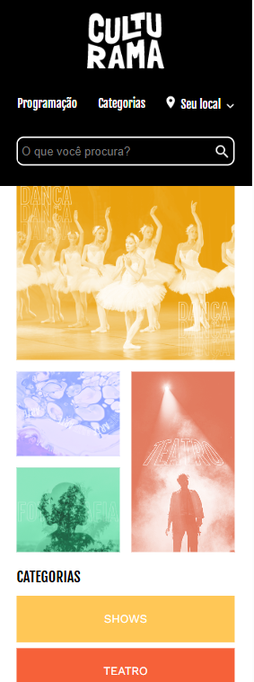
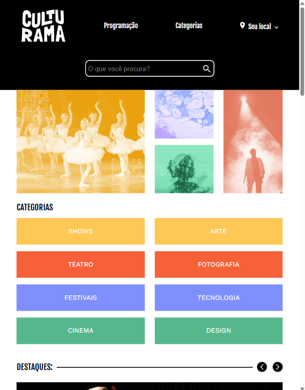
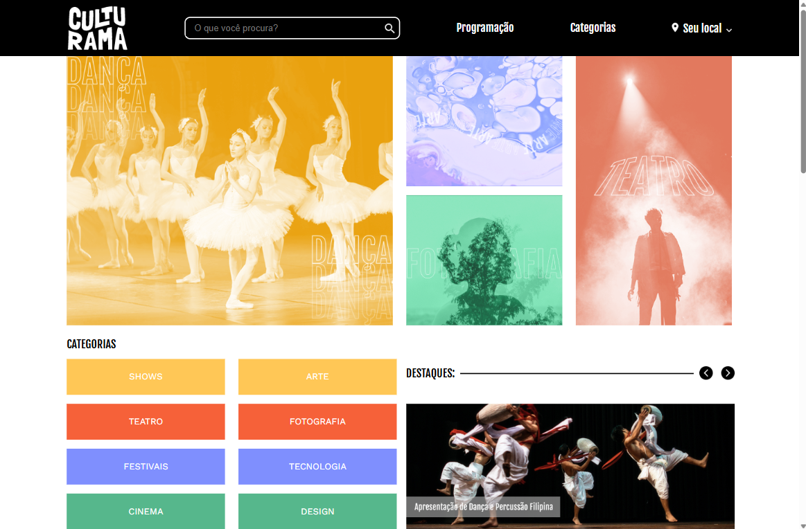

# Culturama

Este projeto é uma landing page para um site de divulgação de eventos chamado "Culturama". O principal objetivo foi aplicar os conceitos de layout em CSS para criar uma página totalmente responsiva, utilizando uma abordagem **Mobile-First**. Foram empregadas as tecnologias **Flexbox** e **Grid Layout** para organizar os elementos de forma eficiente e adaptável a diferentes resoluções de tela.

> A página foi desenvolvida como projeto prático do curso **"Praticando CSS: Grid e Flexbox"** da [Alura](https://www.alura.com.br/).

## 🎨 Preview do Projeto
| Versão Mobile | Versão Tablet | Versão Desktop
| :---: | :---: | :---: |
|  |  |  |

## 🔎 Funcionalidades Chave de Layout
### 📦 CSS Flexbox

O Flexbox foi usado para organizar elementos em uma única dimensão (linhas ou colunas):

-   **`order`:** Usada na versão desktop para alinhar, espaçar e reordenar os itens do menu.
-   **`flex-direction` e `flex-wrap`:** Usado para criar um layout que se transforma de uma coluna vertical (mobile) para uma grade flexível de itens (desktop).
-   **`align-self`:** Usado no rodapé para distribuir as colunas de links de forma uniforme e alinhar o logo na base.

### ▦ CSS Grid Layout

O Grid foi usado para layouts bidimensionais complexos, controlando linhas e colunas simultaneamente:

-   **`grid-column` e `grid-row`:** Usado para criar um layout assimétrico, fazendo com que as imagens do banner ocupem múltiplas células da grade.
-   **`grid-template-areas`:** Usado para organizar o conteúdo de cada card (imagem, textos, botão) de forma precisa e legível. E usado na versão desktop para reorganizar toda a seção em um layout de página complexo, posicionando título, lista e imagens em uma grade definida.
